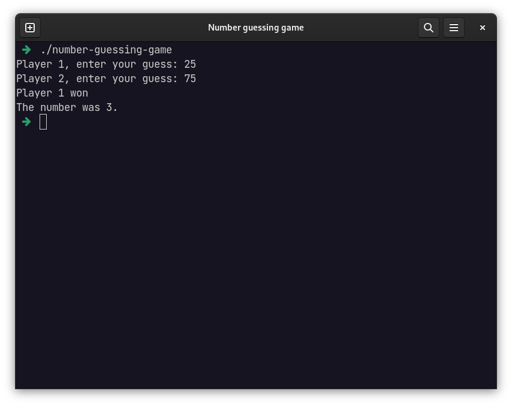

# Number guessing game

Small game where two players compete about who gets closer to randomly generated number.
This project was written as my introduction into [Go programming language](https://go.dev/learn/) to practice some of the
basics.


## Screenshot


## Program setup 
### Prerequisites
For running this application you will need
[Golang installed](https://go.dev/doc/install) on your system.
Game was built with Go version 1.18.

### Downloading & running
```shell
git clone git@github.com:filip0s/number-guessing-game.git
cd number-guessing-game/
go run .
```

## Used technologies
- Golang 1.18
